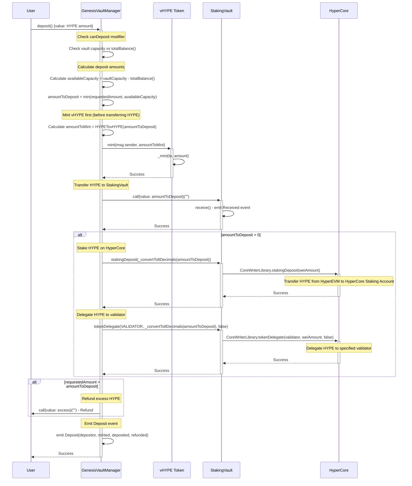

# Architecture

# Contract interactions

## Genesis deposit

```mermaid
sequenceDiagram
    participant User
    participant GVM as GenesisVaultManager
    participant vHYPE as vHYPE Token
    participant SV as StakingVault
    participant HC as HyperCore

    User->>+GVM: deposit() {value: HYPE amount}

    Note over GVM: Check canDeposit modifier
    GVM->>GVM: Check vault capacity vs totalBalance()

    Note over GVM: Calculate deposit amounts
    GVM->>GVM: Calculate availableCapacity = vaultCapacity - totalBalance()
    GVM->>GVM: amountToDeposit = min(requestedAmount, availableCapacity)

    Note over GVM: Mint vHYPE first (before transferring HYPE)
    GVM->>GVM: Calculate amountToMint = HYPETovHYPE(amountToDeposit)
    GVM->>+vHYPE: mint(msg.sender, amountToMint)
    vHYPE->>vHYPE: _mint(to, amount)
    vHYPE-->>-GVM: Success

    Note over GVM: Transfer HYPE to StakingVault
    GVM->>+SV: call{value: amountToDeposit}("")
    SV->>SV: receive() - emit Received event
    SV-->>-GVM: Success

    alt amountToDeposit > 0
        Note over GVM: Stake HYPE on HyperCore
        GVM->>+SV: stakingDeposit(_convertTo8Decimals(amountToDeposit))
        SV->>+HC: CoreWriterLibrary.stakingDeposit(weiAmount)
        Note over HC: Transfer HYPE from HyperEVM to HyperCore Staking Account
        HC-->>-SV: Success
        SV-->>-GVM: Success

        Note over GVM: Delegate HYPE to validator
        GVM->>+SV: tokenDelegate(VALIDATOR, _convertTo8Decimals(amountToDeposit), false)
        SV->>+HC: CoreWriterLibrary.tokenDelegate(validator, weiAmount, false)
        Note over HC: Delegate HYPE to specified validator
        HC-->>-SV: Success
        SV-->>-GVM: Success
    end

    alt requestedAmount > amountToDeposit
        Note over GVM: Refund excess HYPE
        GVM->>User: call{value: excess}("") - Refund
    end

    Note over GVM: Emit Deposit event
    GVM->>GVM: emit Deposit(depositor, minted, deposited, refunded)

    GVM-->>-User: Success
```
