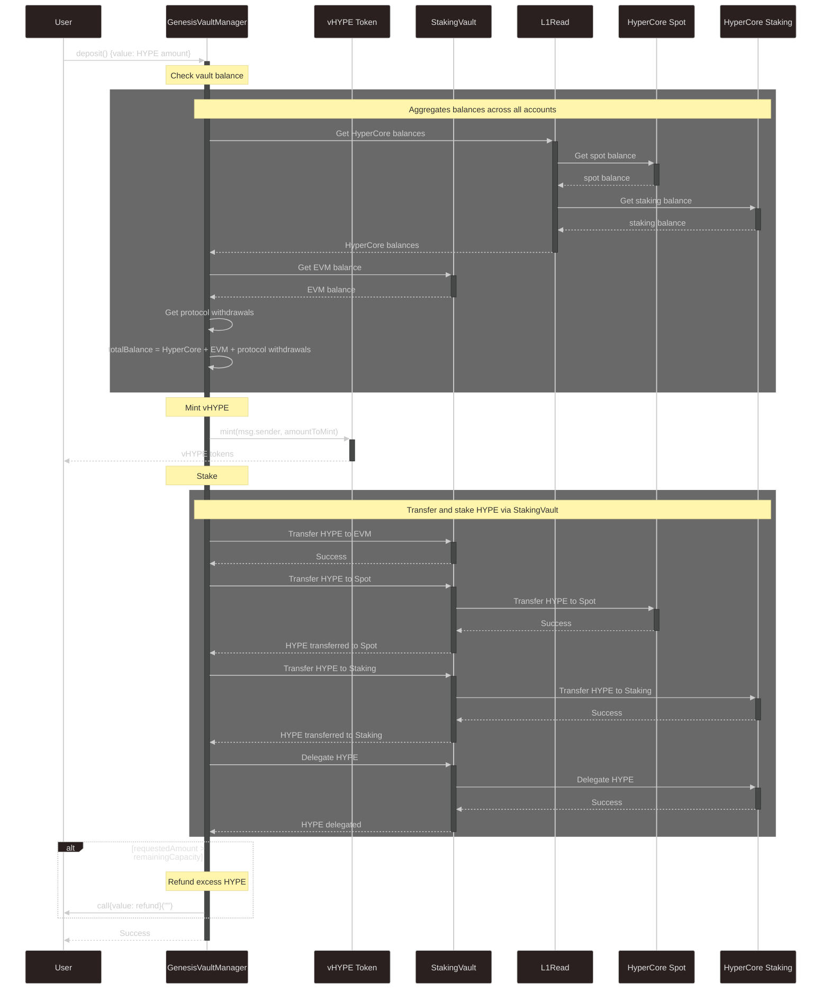
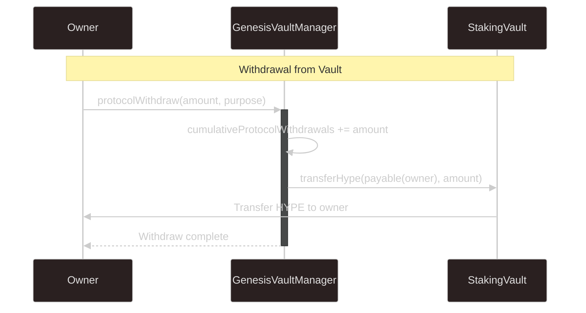
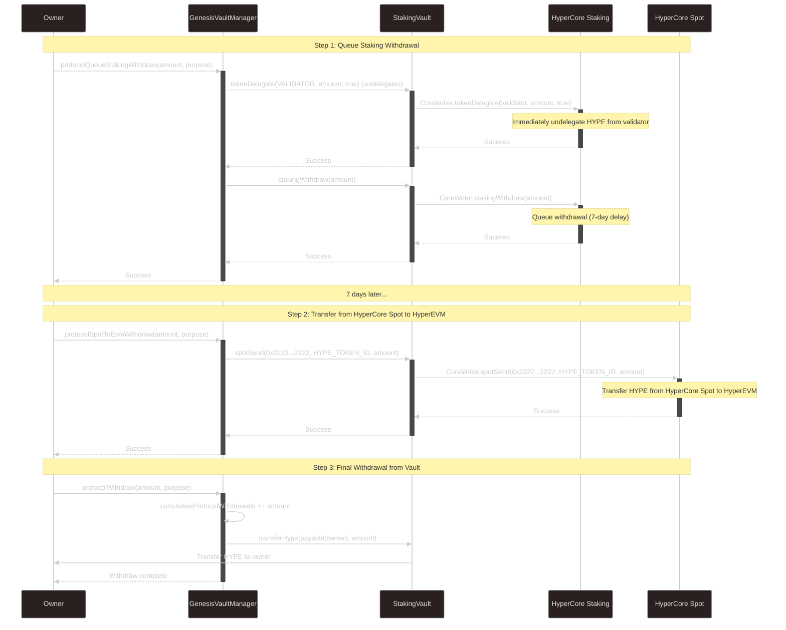

# Architecture

# Contract interactions

## Genesis deposit

## Protocol withdraw (single-step)

Executes a single-step withdraw process if we leave HYPE as HyperEVM reserves.
No HyperCore interactions are required.

## Protocol withdraw (multi-step)

Executes a multi-step withdraw process if we stake all HYPE and don't leave any HYPE as HyperEVM reserves.

