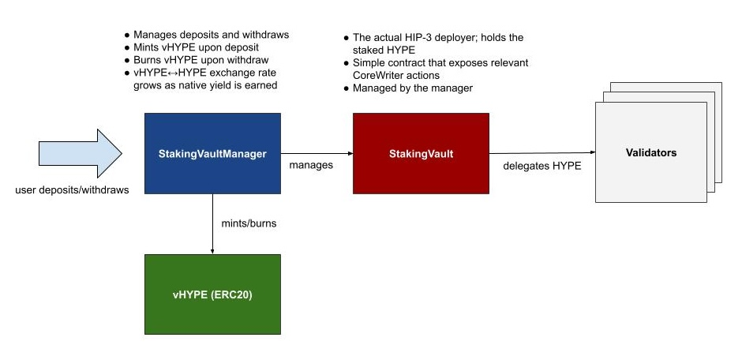

# Architecture

NOTE: Some sections of this document are out of date (09/29/2025). We will be updating these docs shortly.

## Background

Ventuals is creating a HYPE liquid staking token (vHYPE) to raise the minimum stake
requirement for HIP-3 mainnet deployment (currently 500k HYPE). Contributors deposit HYPE
into the vault and receive vHYPE, a fully transferable ERC20 that represents a claim on
their underlying principal.

Any additional HYPE deposited provides a **liquidity buffer**, enabling contributors to
withdraw without reducing the validator stake below the 500k minimum. The vault has no
deposit cap, and contributors can deposit any amount of HYPE at any time. Contributors
may also withdraw at any time, provided the 500k minimum stake is maintained.

All native staking yield accrues automatically to vHYPE holders and is reflected in the
vHYPE/HYPE exchange rate.

## Overview



- **vHYPE**: Fully transferable ERC20 which serves as a claim to the underlying principal HYPE.
- **StakingVault**: Holds HYPE natively staked with validators.
- **StakingVaultManager**: Manages the StakingVault. Handles deposits, withdrawals, minting
  and burning of vHYPE, and enforces the minimum stake requirement (currently 500k HYPE).
- **RoleRegistry**: Centralizes role-based access control across the protocol.

## Access Control

The Ventuals protocol uses a centralized role-based access control system (via the RoleRegistry contract).

### Roles

- `OWNER` – Has the highest level of control. Can upgrade and pause contracts, grant and revoke roles, set
  vault parameters, and execute emergency operations (e.g., withdrawing HYPE). This role is controlled by
  the Ventuals multisig.
- `MANAGER` – Manages the vault. Can deposit, withdraw, delegate, and transfer HYPE on behalf of the vault.
  This role is assigned to the StakingVaultManager, but can be assigned to another contract in the future.
- `OPERATOR` – Handles automated, day-to-day protocol operations (e.g. transferring HYPE from HyperEVM to
  HyperCore, rotating the StakingVault's API wallets).

## Contracts

All contracts are [UUPSUpgradeable](https://docs.openzeppelin.com/contracts/5.x/api/proxy#UUPSUpgradeable)
proxies, and upgrades may only be performed by the `OWNER`.

### StakingVault

- Holds the HYPE that gets staked
- Will be the address of the Ventuals HIP-3 subdex deployer
- Provides a thin wrapper around CoreWriter staking and delegation functionality,
  restricted to the `MANAGER` role, which is assigned to the StakingVaultManager.

#### Key functions

```solidity
function deposit() external payable onlyManager;
function stake(address validator, uint64 weiAmount) external onlyManager;
function unstake(address validator, uint64 weiAmount) external onlyManager;
function tokenRedelegate(address fromValidator, address toValidator, uint64 weiAmount) external onlyManager;
function spotSend(address destination, uint64 token, uint64 weiAmount) external onlyManager;
function transferHypeToCore(uint256 amount) external onlyManager;
function addApiWallet(address apiWalletAddress, string calldata name) external onlyOperator;
```

### StakingVaultManager

- Enforces the minimum stake balance (currently 500k HYPE)
- Allows unlimited deposits
- Allows withdraws, up until the minimum stake balance is reached
- Mints and burns vHYPE to HYPE according to the current exchange rate
- All vHYPE holders automatically earn compounding native staking yield
- As underlying HYPE in the vault grows from native yield, the StakingVaultManager
  mints and burns vHYPE proportionally

#### Key functions

```solidity
function deposit() external payable canDeposit;
function queueWithdraw(uint256 vhypeAmount) external;
function claimWithdraw(uint256 withdrawId, address destination) external;
function batchClaimWithdraws(uint256[] calldata withdrawIds, address destination) external;
function cancelWithdraw(uint256 withdrawId) external;
function processBatch(uint256 numWithdrawals) external;
function finalizeBatch() external;
function exchangeRate() public view returns (uint256);
function totalBalance() public view returns (uint256);
function applySlash(uint256 batchIndex, uint256 slashedExchangeRate) external onlyOwner;
```

### vHYPE

- Standard ERC20 token
- Only the `MANAGER` role can mint vHYPE
- Anyone may burn their vHYPE, effectively donating HYPE to the StakingVault

#### Key functions

```solidity
function totalSupply() public view returns (uint256);
function mint(address to, uint256 amount) external onlyManager;
function burn(uint256 amount) external;
```

### RoleRegistry

The RoleRegistry contract centralizes role-based access control across the protocol. Any contract in the
protocol that requires role-based access control should reference the RoleRegistry.

Roles:

- `OWNER`
- `MANAGER`
- `OPERATOR`

#### Key functions

```solidity
function grantRole(bytes32 role, address account) public override onlyOwner;
function revokeRole(bytes32 role, address account) public override onlyOwner;
function pause(address contractAddress) external onlyOwner;
function unpause(address contractAddress) external onlyOwner
```

## Deposits and Withdrawals

### Lifecycle

#### Deposit

- Users call `deposit` to deposit HYPE into the vault.
- vHYPE is minted proportionally based on the current exchange rate.
- The deposited HYPE is transferred to the StakingVault contract on HyperEVM.

#### Queue Withdraw

- Users call `queueWithdraw` to request a withdrawal.
- The requested vHYPE is transferred to the StakingVaultManager contract and
  held in escrow.
- The withdrawal is assigned a unique ID and added to the end of the global
  withdrawal queue (implemented as a linked list).
- Until processed, escrowed vHYPE continues to accrue native staking yield
  through the vault's exchange rate appreciation.

#### Batch Processing

- A new batch can only be created once per day.
- Each batch records:
  - snapshotExchangeRate – the exchange rate when processing begins
  - vhypeProcessed – total vHYPE included in the batch
- Withdrawals are processed until the vault would drop below the minimum stake
  balance (500k HYPE) or the queue is empty.
- Anyone may call `processBatch` to process withdrawals, as long as it's been
  at least one day since the last batch was finalized.

#### Finalize Batch

A batch is finalized via `finalizeBatch`, which:

- Burns escrowed vHYPE.
- Reserves the equivalent amount of HYPE for withdrawal (totalHypeProcessed).
- Transfers deposits to HyperCore and nets them against withdrawals.
- Stakes excess deposits or unstakes from the validator if withdrawals exceed deposits.
- Anyone may call `finalizeBatch` to finalize a batch, as long as the batch is
  ready to be finalized.

#### Claim Withdraw

- After 7 days from the time the withdraw was finalized, users call `claimWithdraw`
  to claim their HYPE.
- HYPE is calculated using the batch's snapshotted exchange rate (or the
  slashed exchange rate if applicable).
- HYPE is transferred from the vault's HyperCore spot account to the HyperCore
  spot destination.

#### Cancel Withdraw

- A queued withdrawal may be cancelled before it has been processed using `cancelWithdraw`.
- The escrowed vHYPE is immediately returned to the user.

#### Slashing

If a slash occurs while withdrawals are queued or processing:

- The contract is paused to prevent deposits/withdrawals.
- Admins set a `slashedExchangeRate` for affected batches using `applySlash()`,
  which is the exchange rate at the time of the slash.
- Withdrawals in those batches are settled at the slashed rate.

Once reconciled, the contract is unpaused and withdrawals can resume.

## HyperEVM and HyperCore interaction timings

The L1Read precompiles will reflect the HyperCore state **at the beginning of the HyperEVM
block** ([Hyperliquid docs](https://hyperliquid.gitbook.io/hyperliquid-docs/for-developers/hyperevm/interaction-timings)).
This introduces a subtle timing issue when performing actions that update state on HyperCore.
This includes transfers from HyperEVM → HyperCore, and delegating or undelegating from validators.

For example, when a HyperEVM → HyperCore transfer occurs:

- The HyperEVM balance is reduced immediately.
- The HyperCore spot balance queried via L1Read is not updated until the next block.

This desynchronization means that immediately after a transfer to HyperCore, the vault's
`totalBalance()` computation will be incorrect, because it relies on both HyperEVM balances
and HyperCore spot balances. For instance, if a deposit happens after a transfer in the
same block, we will mint vHYPE against an inaccurate exchange rate.

To avoid this, we need to enforce a **one-block delay** between HyperEVM → HyperCore transfers
and any action (such as deposits) that requires an accurate totalBalance(). User deposits
will simply transfer HYPE to the StakingVault on HyperEVM, and then the OPERATOR will
periodically transfer the HYPE from HyperEVM to HyperCore.

In practice:

- Deposits are allowed at the beginning of a block, when L1Read values are up-to-date.
- When the OPERATOR initiates a HyperEVM → HyperCore transfer, subsequent deposits in
  that same block are reverted.
- Deposits may resume in the following block, once L1Read values are up-to-date again.

This ensures that the vault's exchange rate is computed consistently.

### Example:

**Block begins**

- 100 vHYPE supply
- 0 HYPE on HyperEVM
- 100 HYPE on HyperCore
- Exchange rate: 1 HYPE = 1 vHYPE

**User deposits 100 HYPE - `deposit()`**

- 200 vHYPE supply
- 100 HYPE on HyperEVM
- 100 HYPE on HyperCore
- Exchange rate: 1 HYPE = 1 vHYPE

**Operator transfers 100 HYPE to HyperCore - `transferToCoreAndDelegate()`**

- 200 vHYPE supply
- 0 HYPE on HyperEVM
  - ⇒ HyperEVM balance is immediately reduced
- 100 HYPE on HyperCore
  - ⇒ Should be 200 HYPE, but not reflected until next block
- Exchange rate: 1 HYPE = 2 vHYPE
  - ⇒ Exchange rate is incorrect

**Another user deposits 200 HYPE - `deposit()`**

- ⇒ Reverts

**Block ends**

**Next block begins**

- 200 vHYPE supply
- 0 HYPE on HyperEVM
- 200 HYPE on HyperCore
- Exchange rate: 1 HYPE = 1 vHYPE
- ⇒ This is correct now

**User deposits 200 HYPE - `deposit()`**

- 400 vHYPE supply
- 200 HYPE on HyperEVM
- 200 HYPE on HyperCore
- Exchange rate: 1 HYPE = 1 vHYPE

### Diagram


